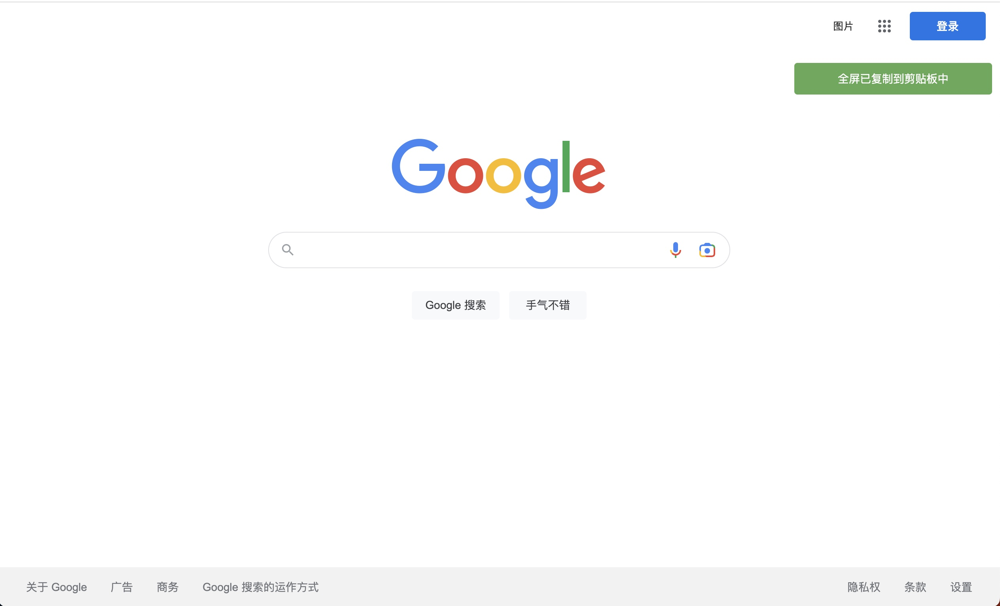

# chrome插件项目

简明教程可以看[这位老哥](https://xieyufei.com/2021/11/09/Chrome-Plugin.html)的

详细教程请阅读[官方文档](https://developer.chrome.com/docs/extensions/mv3/getstarted/)

    
## 网页截图

通过`chrome.tabs.captureVisibleTab`来实现,但官方文档说这个对象不在当前的tab document对象中,而是在插件的后端,所以需要插件的前后端交互实现.

## Toast实现
浏览器提示有三种类型,分别是`alert()` `confirm()` `prompt()` 这三种框都需要手动点选按钮,故无法满足操作之后出现一个浮窗toast实现,搜索了一些资粮之后,发现toast实现主要是通过js代码伪造div元素的生成与删除,代码里也提供了一个简明的Toast实现.
